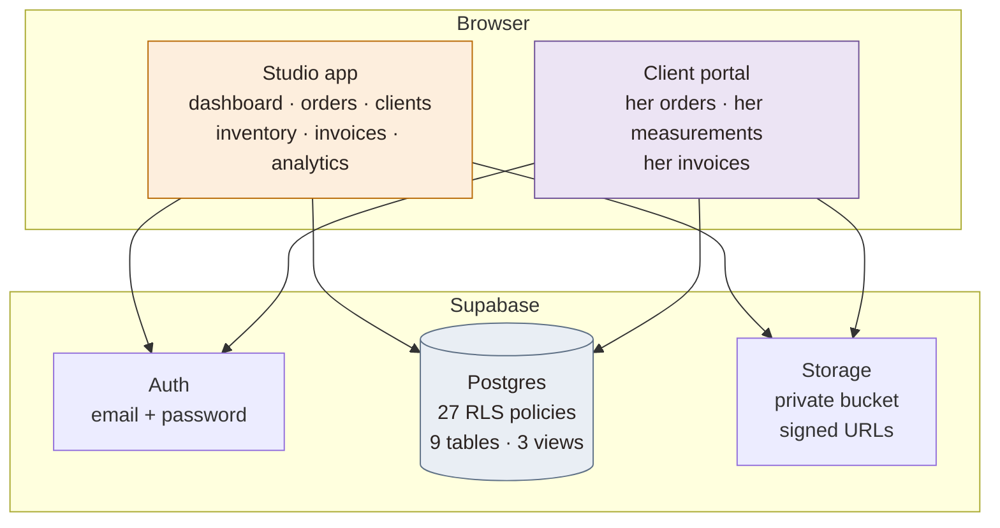
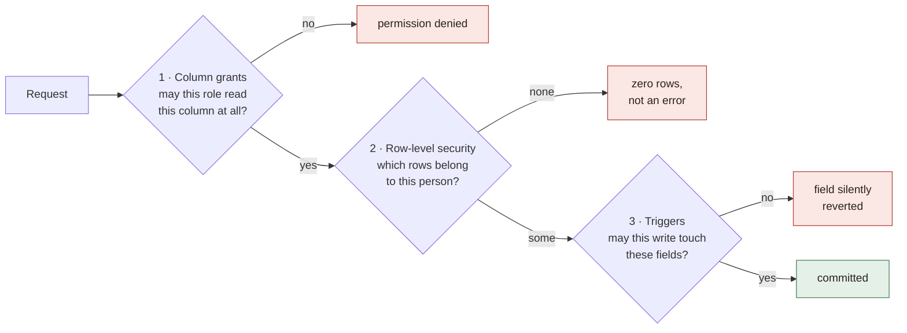

# Bojamiley CRM

A production CRM for a bespoke tailoring house in Lagos, and a client portal to
go with it. Two applications over one Postgres database, where every permission
is enforced by the database rather than by hiding buttons.

Built as a static site with no build step and no framework. In daily use by a
working studio.

<!-- Replace with a live link once deployed -->
**[Live demo](#)** · **[Screenshots](#screenshots)** · **[Security model](#the-security-model)**

---

## The problem

A tailoring studio runs on details that are expensive to lose. A measurement
written on the wrong line, a deposit nobody recorded, a delivery date agreed by
WhatsApp and forgotten. The studio had all of it spread across notebooks and
chat threads.

It also has a second problem most CRMs ignore: **the staff who need the
measurements must not see the money, and the client must see only her own
anything.** A tailor needs a bust measurement to cut. She does not need a
client's phone number, and she certainly does not need to know what the client
paid.

That constraint shaped the whole design.

---

## Two applications, one database



The two apps share helpers and styling but **not a single render path**. A
client's session never executes the studio's screens, so a mis-set role cannot
put the CRM on a client's phone. The database would refuse the data anyway —
this is the second lock, not the first.

---

## The security model

Almost every CRM enforces permissions in the UI and hopes nobody opens the
network tab. This one pushes the rules into Postgres, where they hold whether
the request comes from the app, a script, or curl.

### Three layers, not one



**Column-level grants.** `clients.phone`, `clients.email`, `clients.address`,
`orders.price` and `orders.payments` carry no `SELECT` grant for the
`authenticated` role at all. Money and contact details are served through
separate views that gate on role. A staff member querying the table directly
does not get a filtered result — the query fails. There are **98 column-level
grants** doing this work.

**Row-level security.** 27 policies decide which rows each person sees. A client
is scoped to exactly one client record and its orders; the studio sees
everything it is entitled to.

**Triggers as a backstop.** `protect_order_money` ignores any price or payment
written by a non-admin, rather than rejecting the write. A staff member editing
an order simply cannot move the money, whatever the request body says.

### What each role actually reads

Measured against the live database, not asserted:

| | clients | orders | photos | invoices | contacts | money | stock |
|---|---|---|---|---|---|---|---|
| **Admin** | all | all | all | all | all | all | all |
| **Staff** | all | all | all | — | — | — | all |
| **Viewer** | all | all | all | — | — | — | all |
| **Client** | **hers** | **hers** | **hers** | **hers** | **hers** | **hers** | — |
| Signed up, not yet linked | — | — | — | — | — | — | — |

A client who has signed up but has not been connected to a record by an admin
reads nothing at all but the business name.

### Connecting a client is deliberate

A sign-up is never matched to a client record automatically. Matching on a phone
number would let anyone who knows one claim another woman's measurements and
order history. An admin connects each account by hand.

---

## Engineering decisions worth reading

Some of these were forced by the problem rather than chosen for elegance.

<details>
<summary><b>Client measurements never overwrite the studio's</b></summary>

A client can send her measurements from her phone. They land in
`pending_measurements` and wait for someone at the studio to accept them, with
the differences listed side by side.

A number mistyped at home should not reach the cutting table on its own. Fabric
is expensive and the mistake surfaces at the fitting, far too late.
</details>

<details>
<summary><b>Requests are numbered separately from orders</b></summary>

An order a client asks for is `REQ-001`. It only takes a real `ORD-` number when
the studio accepts it.

If requests drew from the order sequence, every declined request would leave a
permanent gap in the studio's order numbering — and that numbering is their
bookkeeping.
</details>

<details>
<summary><b>A request is not work, and the code says so</b></summary>

`isOpen()` excludes requested orders. They never inflate the active count, and
are never measured against the overdue clock — the date on a request is the
client's hope, not something the studio agreed to.

The price is set in the same statement that accepts the order, so an order can
never exist as real work with no price. Accepted at zero, it would read as fully
paid.
</details>

<details>
<summary><b>The invoice is drawn, not screenshotted</b></summary>

Invoices generate as a real PDF and as a picture, both drawn from the same page
geometry in millimetres rather than captured from the DOM. The text stays sharp,
the file stays around 10 KB, and no rendering library is involved.

The picture exists because it appears inline in a WhatsApp chat, where a PDF
arrives as a file the client has to tap. It also renders a proper `₦`: the
canvas uses the studio's own webfont, where jsPDF's built-in fonts have no naira
glyph and have to fall back to `NGN`.
</details>

<details>
<summary><b>Dark mode that cannot ruin a printed job card</b></summary>

The dark palette lives inside `@media screen`. On paper the light tokens always
win, so a job card printed from dark mode is not near-white ink on white paper.

The invoice re-declares the light tokens locally, so it stays on white even
while the surrounding app is dark. Verified at 16.6:1 body contrast.
</details>

<details>
<summary><b>The whole palette clears WCAG AA</b></summary>

Every foreground/background pair in both themes was measured and adjusted:
worst case **4.61:1 in light**, **5.62:1 in dark**.

Colours were scaled toward black rather than re-picked, so hue and saturation
are unchanged and the boutique palette still reads the same.
</details>

---

## Performance

The studio and its clients are on Nigerian mobile data. That is the constraint
the front end is designed around.

| | gzipped |
|---|---|
| `app.js` | 52 KB |
| `supabase.js` | 52 KB |
| `crm.css` | 11 KB |
| **every page load** | **115 KB** |
| `jspdf.js` | 113 KB — *fetched only when an invoice PDF is wanted* |

The PDF engine is larger than the application and its database client combined,
and is reached from one button only an admin sees. Loading it eagerly meant
every client downloaded it to render a screen that cannot make a PDF. Moving it
behind a lazy load **halved what ships on every visit**.

Photos are compressed in the browser before upload — a 3–8 MB phone photo
becomes 150–250 KB — and served from a private bucket through short-lived
signed URLs.

---

## Built with

**No framework, no build step, no bundler.** The entire front end is three files
served as-is: 4,400 lines of ES5-style JavaScript in a single IIFE, 1,650 lines
of CSS driven by custom properties, and one HTML shell.

That was a deliberate constraint. The studio needed something that would still
run in five years without a toolchain to resurrect, and the whole thing is
readable end to end by whoever inherits it.

| | |
|---|---|
| **Front end** | Vanilla JavaScript · CSS custom properties · zero dependencies |
| **Backend** | Supabase — Postgres, Auth, Storage |
| **Security** | 27 RLS policies · 98 column grants · 13 `SECURITY DEFINER` functions · 5 triggers |
| **Documents** | jsPDF (lazy) · Canvas 2D for the picture |
| **Hosting** | Netlify, static |

---

## Screenshots

<!--
  Add the files below to docs/screenshots/ and delete this comment.
  See docs/screenshots/README.md for exactly what to capture — and please use
  the fictional data described there rather than real client records.

| | |
|---|---|
|  |  |
| **Studio dashboard** — overdue work first | **Order** — pipeline, photos, payments |
|  |  |
| **Client portal** — her order as a journey | **Measurements** — sent for the studio to confirm |
|  |  |
| **Invoice** — PDF and picture from one layout | **Dark mode** — print stays on white |
-->

> Screenshots pending. See [`docs/screenshots/README.md`](docs/screenshots/README.md)
> for the capture guide.

---

## Running it locally

No build step. Serve the `crm/` directory:

```bash
python -m http.server 4173 --directory crm
```

Point `crm/js/config.js` at a Supabase project:

```js
window.CRM_CONFIG = {
  url: "https://<project>.supabase.co",
  key: "<publishable key>"
};
```

The publishable key is safe to ship — every permission is enforced by row-level
security, so the key alone grants nothing.

**The first account created becomes the Admin.** Everyone after that waits for
approval.

---

## Project structure

```
crm/
├── index.html          four app shells: loading, auth, studio, client portal
├── css/crm.css         one stylesheet, two themes, all tokens
├── js/
│   ├── app.js          the application, one IIFE
│   ├── config.js       Supabase project URL and publishable key
│   ├── supabase.js     vendored client
│   └── jspdf.js        vendored, loaded on demand only
├── _headers            Netlify cache rules
└── README.md           the studio's own user guide
```

Assets carry a `?v=` stamp bumped on release, and `index.html` is served
`no-cache`, so a phone with the app on its home screen cannot serve a stale copy
of a fix.

---

## Status

In production. 46 commits, developed against the live studio without an outage.

Currently: order tracking, measurements, payments, inventory with stock
movements, photo galleries, invoicing, analytics, a client portal with
self-service measurements and order requests.

Next: live updates over Supabase Realtime for orders and photos, so a client
watching her dress does not have to refresh.

---

## Licence

MIT — see [LICENSE](LICENSE).
